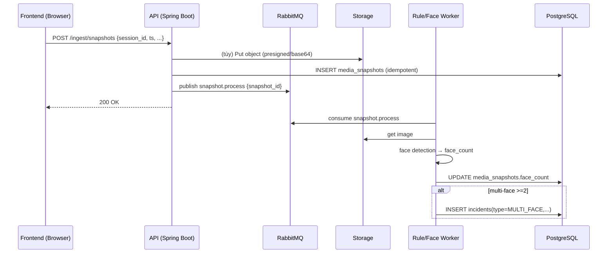
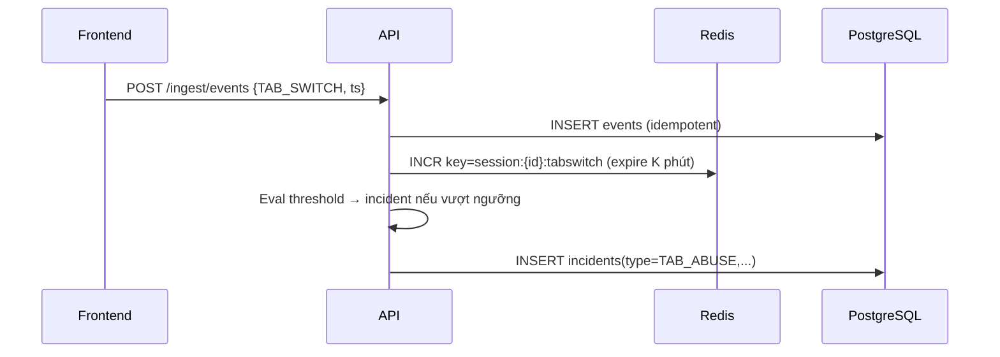
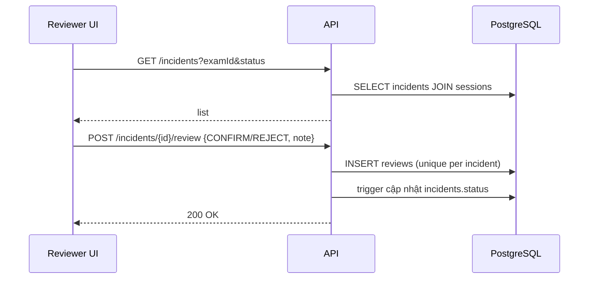

# Kiến trúc hệ thống — Online Exam Cheating Detection

Tài liệu mô tả kiến trúc logic, luồng dữ liệu, phân rã thành phần và vận hành (observability, bảo mật, mở rộng).

## Tổng quan thành phần

```mermaid
flowchart LR
  C[Candidate Browser]
  FE[Frontend (React)]
  GW[API (Spring Boot)]
  MQ[(RabbitMQ)]
  R[Redis]
  DB[(PostgreSQL)]
  ST[(Storage: MinIO/S3 or Volume)]
  RE[Rule/Face Worker]
  PR[Proctor/Reviewer UI]

  C -->|Web App| FE
  FE -->|JWT RS256| GW
  FE -->|Snapshots/Telemetry| GW
  GW --> DB
  GW --> R
  GW --> MQ
  GW --> ST
  RE --> MQ
  RE --> ST
  RE --> DB
  PR -->|JWT| GW
```

Vai trò:
- Frontend: ứng dụng thí sinh (ingest) + dashboard reviewer.
- API: nhận dữ liệu, xác thực, tạo session, tính rule (sync/light) + đẩy job xử lý ảnh sang hàng đợi.
- Worker: xử lý ảnh/face detection async; cập nhật `face_count`, sinh incident multi-face/no-face.
- Redis: đếm sự kiện theo cửa sổ thời gian (ví dụ tab_switch/5 phút) để phát hiện gần thời gian thực.
- RabbitMQ: phương tiện truyền sự kiện ảnh và job xử lý.
- Storage: lưu bằng chứng ảnh/video; DB chỉ lưu metadata + URL.

## Luồng dữ liệu chính

### 1) Ingest snapshot (đồng bộ metadata + bất đồng bộ xử lý)



### 2) Ingest telemetry + Rule Tab-abuse



### 3) Review incident



## Bảo mật

- JWT RS256: xác thực bằng public key (JWKS). Claim đề xuất: `sub`, `role`, `exp`, `iat`, `aud`.
- RBAC: kiểm soát truy cập endpoint và tài nguyên (ví dụ evidence chỉ cho PROCTOR/REVIEWER/ADMIN, không cho CANDIDATE).
- Evidence: cấp presigned URL (TTL ngắn) khi UI cần xem. Storage không công khai trực tiếp.
- API: chuẩn hóa idempotency để tránh replay; rate limit cơ bản cho ingest.

## Khả năng mở rộng & độ trễ

- Scale-out API (stateless) phía sau load balancer.
- Worker tách process, auto-scale theo hàng đợi (queue length, lag). Sử dụng batching nhẹ nếu cần.
- Redis window counters giúp rule gần thời gian thực với chi phí thấp.
- Mục tiêu: P95 từ ingest snapshot đến incident < 3–5s.

## Observability

- Prometheus metrics gợi ý:
  - `ingest_snapshots_total`, `ingest_events_total`
  - `rule_incidents_total{type}`
  - `rule_latency_seconds{type}` (histogram)
  - `queue_lag_seconds`, `worker_jobs_inflight`
  - `api_request_duration_seconds` (histogram)
  - `errors_total{component}`
- Logs có trace_id/correlation_id theo session_id.

## Ràng buộc dữ liệu & retention

- Composite unique cho idempotency: `events(session_id, ts, event_type)`, `media_snapshots(session_id, ts)`; vẫn giữ `idempotency_key` để linh hoạt client.
- `exams.retention_days`: job dọn evidence theo kỳ thi; xóa file + metadata an toàn (soft-delete optional).

## Phát triển & triển khai

- Docker Compose cho Postgres, Redis, RabbitMQ, (MinIO tuỳ chọn). Backend/Frontend containerized.
- Migrate DB: Flyway/Liquibase khi triển khai thực tế (hiện có `sql/schema.sql`).
- Config: `.env` + Spring profiles (`dev`, `prod`).

---
Tham chiếu: `docs/requirements.md`, `docs/api/openapi.yaml`, `sql/schema.sql`.
